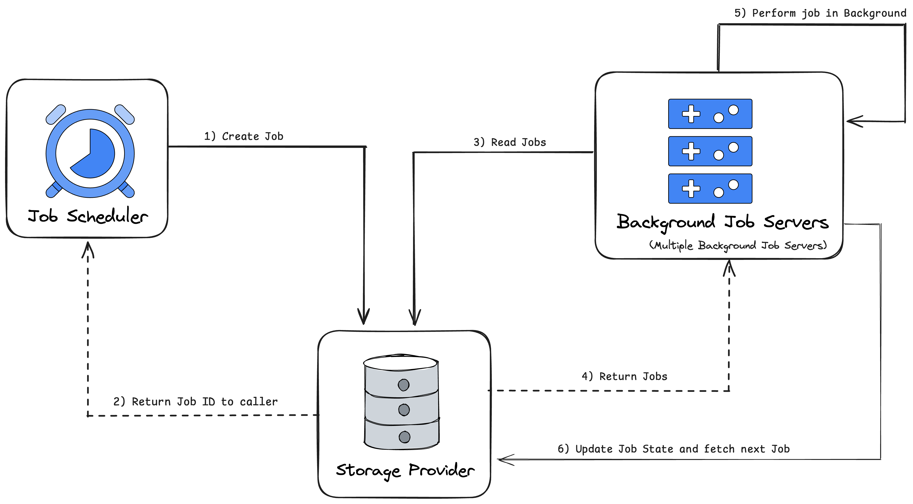

# Distributed Scheduler in Spring Boot using JobRunr

### Project Structure - 
As we're building a **Distributed Scheduler**, so as part of this project we've 4 modules :

- leader - Spring Boot Application which Act as a **Leader** Node in the cluster which distribute the jobs among the worker nodes.
- worker1 - Spring Boot Application which Act as **first worker** Node in the cluster.
- worker2 - Spring Boot Application which Act as **second worker** Node in the cluster.
- common - Application which will have **common/shared** code used between worker Node.

### APIs
As part of this project we exposed 2 APIs - 

1. [POST] /v1/api/job/schedule - used to Schedule a job, (As part of this Project, we created a scheduler which will execute after some time in milliseconds (Provided in the RequestBody). We can add more Scheduling requirements like schedule a task to be run at the desired moment etc.) with Request Body -

```
{
    "jobId": "f1d8143f-d545-4416-9b2f-0a76fad11f97", 
    "scheduleForInMillis": 30000        
}
```
2. [DELETE] /v1/api/job/delete/{jobId} - used to delete the scheduled Job by passing jobId as Path variable.
## JobRunr Architecture

